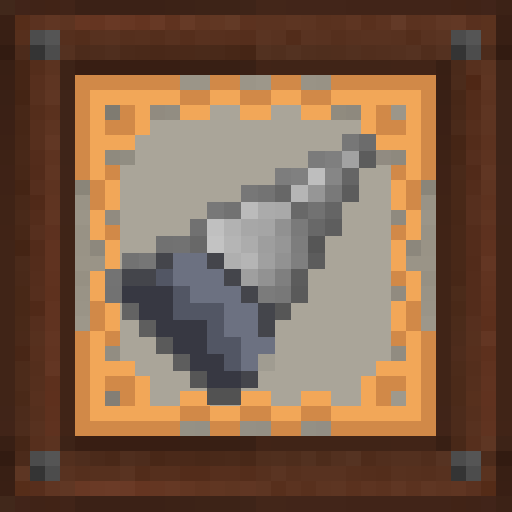

# Engineer's Tool Upgrades

**Engineer's Tool Upgrades** (`engtoolup`) is a Minecraft mod addon for [Immersive Engineering](https://github.com/BluSunrize/ImmersiveEngineering) that adds new tools, tool upgrades, and quality-of-life items and features for IE's tools.

## Requirements

- Minecraft **1.20.1**
- Minecraft Forge **47.4.22+**
- Immersive Engineering (required dependency)

## Features

### Tool Upgrades

- **Magnetic Drill Extender** - extends the reach of IE drills.
- **Fluid Sensor** - detects nearby lava.
- **Antiblast Plate** - explosive knockback nullifier.
- **Flashlight** - a dynamic light source for mining.

### Drill Heads

- **Prospector Drillhead** - silk touch effect.
- **Lead Drillhead** - cheaper, faster, 1x1 block mining area, more damage.

### QoL

- **Inspect any item** - Any item that has a presence in the IE's manual, will link to the specific page when the player holds the keybind while hovering, with teh cursor, the item.

## Installation

1. Install [Minecraft Forge](https://files.minecraftforge.net/) 47.4.22 or newer for Minecraft 1.20.1.
2. Install [Immersive Engineering](https://github.com/BluSunrize/ImmersiveEngineering).
3. Download the latest `engtoolup` jar from Modrinth or Curseforge.
4. Drop the jar into your `mods` folder.

## License

See [LICENSE](LICENSE) for details.

## Author

JoniEnginyer - Only me, for now
